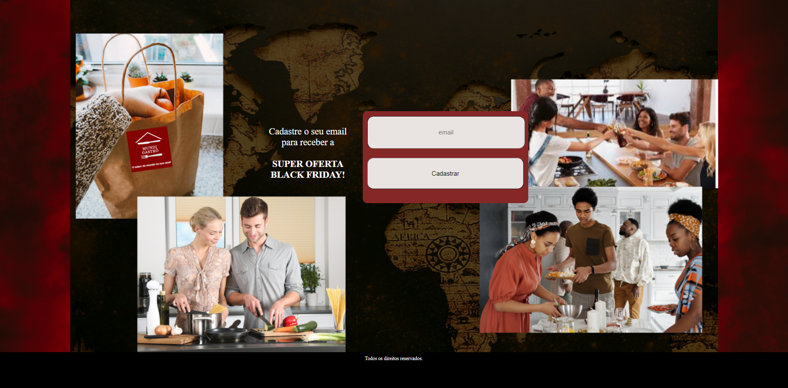

# Landing Page Black Friday

Projeto desenvolvido durante a jornada do Hiring Coders.

Desenvolvimento de uma landing page utilizando as ferramentas: HTML, JavaScript e CSS
com a finalidade de divulgar uma promoção Black Friday e que seja possível a pessoa cadastrar o email para receber a promoção.

Criei a empresa Mundi Gastrô que funciona por meio de uma assinatura mensal. Mensalmente é escolhido um menu de comidas típicas de um determinado país e são enviados os ingredientes para casa dos clientes, no qual eles prepararão o menu com o auxílio do vídeo explicativo disponibilizado no aplicativo Mundi Gastrô.

link da landing page: https://cunhac.github.io/landing_page_black_friday/index.html

<hr>

## Landing Page





<hr>

## Estrutura do repositório

```
landing_page_black_friday
├── assets
│   ├── backgroundOne.png
│   ├── backgroundTwo.png
│   └── logo.png
├── css
│   └── style.css
├── docs
│   ├── landing_page_one.png
│   └── landing_page_two.png
├── js
│   └── script.js
├── index.html
└── readme.md
```

`assets`: estão armazenadas as imagens do logo e plano de fundo da primeira e da segunda parte da landing page.

`css`: possui o arquivo *style.css* aonde estão armazenadas as configurações de estilo da landing page.

`docs`: estão armazenadas as imagens da landing page finalizada.

`js`: possui o arquivo *script.js* que tem o código responsável por fazer a interação com o localStorage. 

`index.html`: responsável pela estrutura da landing page.
